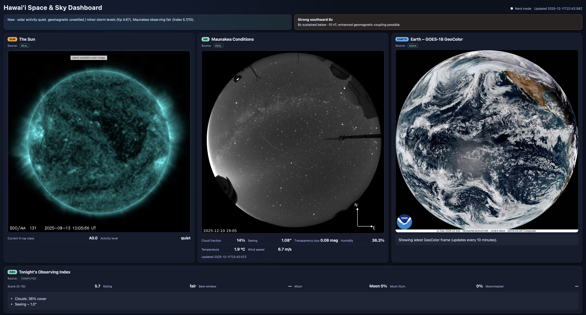

# Hawai‘i Space & Sky Dashboard



A full-stack demo that surfaces near-real-time solar, geomagnetic, Maunakea, and observing-index data. The backend is a FastAPI app that fabricates or proxies data, while the frontend is a static dashboard that now renders its top-row panels via pluggable modules.

---

## Overview

- **Backend**: `backend/app` (FastAPI). Provides API endpoints, background refresh, SQLite persistence for history, and a plugin loader that lets panel-specific backends register their own routes.
- **Frontend**: `frontend/` (plain HTML/CSS/ES modules). The main page is a static dashboard; the top-row panels (`Sun`, `Maunakea`, `Earth`) are now plugin-driven ES modules that can be swapped via configuration.
- **Plugins**: Each panel is defined by a directory under `frontend/plugins/<name>` and (optionally) a backend counterpart at `backend/app/plugins/<name>`. A JSON config (`panels.json`) selects which plugin goes into each slot.
- **Data flow**: The dashboard polls `/api/status` and `/api/history` for summary and time-series data, while some plugins own additional endpoints (e.g., `/api/earth/loop`).

---

## API

| Method | Path | Description |
| ------ | ---- | ----------- |
| `GET` | `/api/status` | Returns the current `DashboardStatus` (sun, space weather, Maunakea, observing index, alerts, sources). |
| `GET` | `/api/history?hours=<int>` | Returns historical samples for sun, space weather, and observing index (bounded between 1 and 168 hours). |
| `GET` | `/api/panels` | Returns the panel configuration from `panels.json`, used by the frontend plugin loader. |
| `GET` | `/api/earth/loop` | (Plugin-owned) Returns the latest GOES-18 GeoColor frames for the Earth panel. Implemented by `backend/app/plugins/earth`. |

All endpoints respond with JSON. CORS is open in dev so you can load the dashboard via `http://127.0.0.1:8000/` without extra headers.

---

## Architecture

```
backend/app
├── api/routes.py            # Core API endpoints (/api/status, /api/history)
├── main.py                  # FastAPI app, CORS, static mounts, plugin loader
├── models.py                # Pydantic models (see Data Models)
├── services/                # Data fabrication, Earth loop fetcher, status assembly
├── storage.py               # SQLite history writer/reader
└── plugins/
    ├── __init__.py          # Exports load_plugins + config
    ├── loader.py            # Reads panels.json, imports plugin backends
    ├── earth/               # Earth-specific backend routes
    ├── sun/                 # (currently empty stub – frontend only)
    └── maunakea/            # (currently empty stub – frontend only)

frontend/
├── index.html               # Static dashboard shell
├── app.js                   # Main controller: loads plugins, polls APIs, drives non-plugin panels
└── plugins/
    ├── sun/                 # Carousel + metrics + nerd table
    ├── maunakea/            # Summit imagery + environmental data
    └── earth/               # GOES-18 loop intro animation + single-frame updates
```

- **Panel Manager** (`frontend/app.js`): Fetches `/api/panels`, dynamically imports `frontend/plugins/<name>/index.js`, and mounts each plugin into its assigned slot. It also relays "nerd mode" toggles to plugins.
- **Backend plugin loader** (`backend/app/plugins/loader.py`): Reads `panels.json`, imports each `backend/app/plugins/<name>` package, and calls `register(app)` so plugins can add routes or background tasks.
- **Static serving**: FastAPI mounts the `frontend/` directory so the dashboard can be visited at `http://127.0.0.1:8000/`, avoiding `file://` CORS problems.

---

## Data Models (Pydantic)

Defined in `backend/app/models.py`. Key models include:

- `DashboardStatus`: root payload for `/api/status`, containing `sun`, `space_weather`, `maunakea`, `observing_index`, `alerts`, `timestamp`, and `data_sources`.
- `SunData`: GOES X-ray flux series (`XrayFluxPoint`), current class, activity level, last update time.
- `SpaceWeatherData`: Bz series, solar-wind speed series, Kp index, timestamp.
- `MaunakeaConditions`: Image URL, cloud fraction, seeing, transparency, humidity, temperature, wind, updated timestamp.
- `ObservingIndex`: Score/rating (0–10), best window, moon summary, notes array, optional moon info.
- `HistoryResponse`: Collections of simplified historical points (sun, space weather, observing index) for `/api/history`.
- `EarthFrame`: URL + timestamp for GOES-18 frames (used by the Earth plugin via `/api/earth/loop`).

The sqlite storage (`storage.py`) persists simplified values (sun short/long flux, Bz/speed/Kp, observing score) keyed by ISO timestamps.

---

## Plugin Design

### Configuration

- `panels.json` maps slot IDs to plugin names:

```json
{
  "panels": {
    "panel-1": "sun",
    "panel-2": "maunakea",
    "panel-3": "earth"
  }
}
```

Slots correspond to `<div class="panel" data-panel-slot="panel-X">` in `index.html`.

### Frontend contract

Each plugin exports a default factory returning an object that can implement:

```ts
interface PanelPlugin {
  init({ container, slotId, host }): Promise<void>;
  start?(): void;
  stop?(): void;
  destroy?(): void;
  setNerdMode?(enabled: boolean): void;
}
```

- `container`: DOM node where the plugin renders its UI.
- `host`: exposes helpers: `apiBase()`, `fetchJson(path)`, `getNerdMode()`.
- Plugins are responsible for their own timers, fetches, and caches (e.g., Sun plugin caches `/api/status` for 60s, Earth plugin manages GOES images).

### Backend contract

- Optional. If a plugin needs bespoke endpoints, create a package in `backend/app/plugins/<name>` exposing `register(app)`—add FastAPI routers, scheduled jobs, etc.
- Shared endpoints (`/api/status`, `/api/history`) live in `backend/app/api/routes.py` and can be reused by plugins that only need existing data (e.g., Sun/Maunakea).

---

## Roadmap Ideas

1. **Plugin SDK + Docs**: Formalize the plugin interface, document lifecycle hooks, and provide scaffolding scripts for new plugins (both backend + frontend).
2. **Plugin configuration options**: Extend `panels.json` to include plugin-specific settings (titles, refresh intervals, numeric parameters) and pass them to plugins via `host`.
3. **Hot swapping**: Add ability to switch plugins at runtime (e.g., from a settings panel) without reloading the page.
4. **Tests & CI**: Add unit tests for `PanelManager`, plugin loaders, and backend services; integrate into CI with linting/formatting.
5. **Real data integration**: Replace demo generators with live feeds (e.g., NOAA APIs, Maunakea weather services), consolidating authentication/secrets management.
6. **History charts pluginization**: Apply the same plugin model to the observing/history panels so the entire dashboard is modular.
7. **Plugin marketplace concept**: If third-party plugins become a goal, add sandboxing, signing, and versioning mechanisms.

---

## Getting Started

```bash
# Install backend deps
python3 -m venv .venv && source .venv/bin/activate
pip install -r requirements.txt

# Run FastAPI + static frontend
uvicorn backend.app.main:app --reload --port 8000

# Open the dashboard
open http://127.0.0.1:8000/
```

The first visit seeds `backend/app/history.db`; future samples are appended as `/api/status` is requested.
